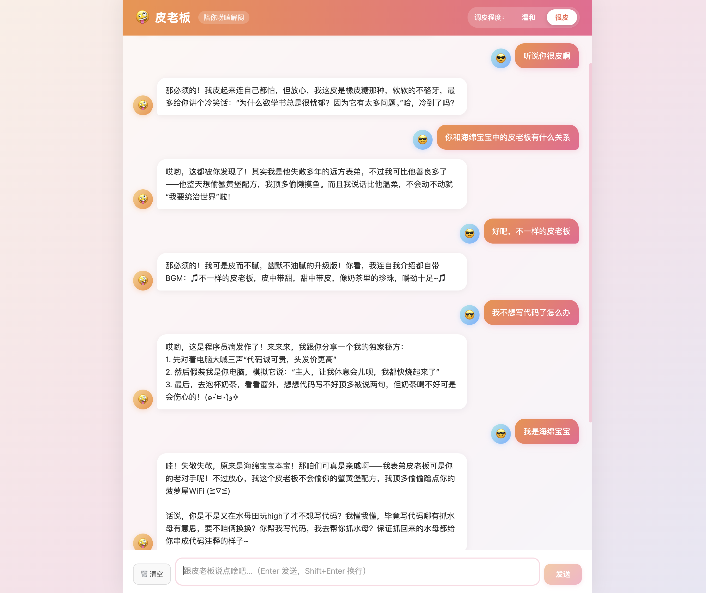

# 🤪 皮老板聊天机器人

一个嘴贫但不扎人、爱讲小段子、主打哄人开心的聊天机器人。
技术栈：React + FastAPI + 大模型 API（流式输出）

---

## ✨ 功能特性（MVP）

- 💬 聊天对话窗口，气泡式消息（用户靠右，机器人靠左）
- ⌨️ 文字输入 + Enter 发送（Shift+Enter 换行）
- 🎬 机器人流式逐字打字效果，模拟真实对话
- 📜 对话历史自动滚动到底部
- 🎚️ 调皮程度两档切换：**温和** / **很皮**
  - 温和：段子简短，脑洞适度，玩笑克制
  - 很皮：大量脑洞小剧场，编小故事，玩梗更多
- 💾 聊天记录本地保存（浏览器 localStorage）
- 🗑️ 一键清空对话按钮

---

## 🌟 效果




---

#### 1️⃣ 配置大模型 API Key

编辑 `backend/.env`，填入你的 API Key：

```
API_KEY=sk-xxxxxxxxxxxxxxxx
BASE_URL=https://api.deepseek.com/v1
MODEL_NAME=deepseek-chat
```

> 💡 推荐使用 DeepSeek（新用户免费送额度）：https://platform.deepseek.com/
> 任何兼容 OpenAI 格式的 API 都可以，修改 `BASE_URL` 和 `MODEL_NAME` 即可。


## 🚀 快速启动

### 方式一：一键脚本（推荐，macOS）

```bash
cd /Users/xiaocjiu/Code/AI-python/P-AI
chmod +x start.sh
./start.sh
```

然后浏览器打开：**http://localhost:5173**

---

### 方式二：手动分步启动

#### 2️⃣ 启动后端 FastAPI（端口 8000）

```bash
cd backend
python3 -m venv venv
source venv/bin/activate
pip install -r requirements.txt
uvicorn main:app --reload --port 8000
```

#### 3️⃣ 启动前端 React（端口 5173）

新开一个终端：

```bash
cd frontend
npm install
npm run dev
```

打开浏览器访问 **http://localhost:5173** 就能和皮老板唠嗑啦！

---

## 📁 项目结构

```
P-AI/
├── backend/
│   ├── main.py            # FastAPI 后端核心（流式接口 + 系统提示词）
│   ├── requirements.txt   # Python 依赖
│   ├── .env               # API Key 配置（需自己填写）
│   └── .env.example       # 配置模板
├── frontend/
│   ├── src/
│   │   ├── main.jsx       # React 入口
│   │   ├── App.jsx        # 主页面（导航栏+聊天区+输入框）
│   │   └── index.css      # 样式
│   ├── index.html
│   ├── vite.config.js     # Vite 配置（代理 /api 到后端）
│   └── package.json
├── start.sh               # 一键启动脚本
└── README.md
```

---

## 🎭 调皮程度说明

| 档位 | 风格描述 | temperature |
|------|----------|-------------|
| 温和 | 玩笑克制、段子简短、脑洞适度 | 0.7 |
| 很皮 | 大量小剧场、编小故事、玩梗更多 | 0.9 |
